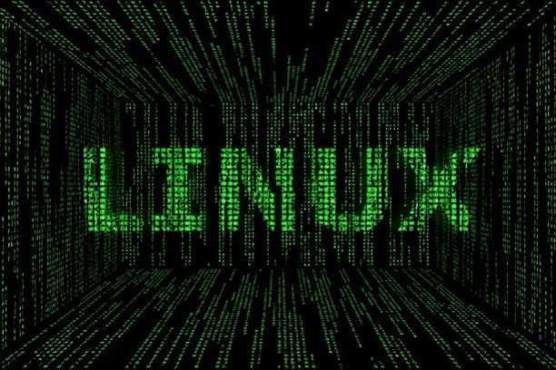

# 🐧 Linux Hands-On Practices

This repository contains structured **Linux hands-on exercises** created to build and strengthen real-world Linux administration and shell scripting skills.  
Each folder represents a single lab session (`Linux-01`, `Linux-02`, etc.), including step-by-step terminal practice in the `LAB.md` file.

---

## 🎯 Purpose

This repository is dedicated exclusively to **hands-on Linux practice**.  
It is not a theoretical note collection, but a workspace for:

- Practicing fundamental and advanced Linux commands
- Managing users, files, and permissions
- Learning automation with shell scripting
- Using filters, operators, `sed`, `awk`, and cron jobs
- Building a strong foundation for DevOps and Cloud Engineering

---

## 🧩 Repository Structure

Each folder corresponds to one Linux topic:

Linux-01 : Managing Files in Linux
📁 Linux-02 : Linux Environment Variables
📁 Linux-03 : Managing Users and Groups
📁 Linux-04 : Filters and Control Operators
📁 Linux-05 : sed & awk command and crontab
📁 Linux-06 : Shell Scripting Basics
📁 Linux-07 : Shell Scripting / Conditional Statements
📁 Linux-08 : Shell Scripting / Loops
📁 Linux-09 : Shell Scripting / Functions

Each folder contains:

- `LAB.md` → step-by-step lab instructions
- (optional) `scripts/` → bash or automation scripts
- (optional) `screenshots/` → output verification images

---

## 🧠 Topics Covered

| Category                   | Example Hands-On Focus                                    |
| -------------------------- | --------------------------------------------------------- |
| 📂 File Management         | Creating, moving, copying, deleting files and directories |
| 👥 User & Group Management | Adding/removing users, permissions, sudo access           |
| ⚙️ System Environment      | PATH variables, aliases, environment setup                |
| 🔎 Text Processing         | grep, cut, sort, uniq, wc, tr, head, tail                 |
| 🧱 Stream Editing          | sed, awk, regex, file manipulation                        |
| 🕒 Task Scheduling         | crontab, at, system timers                                |
| 🧮 Shell Scripting         | Variables, operators, loops, conditionals, functions      |
| 🧰 Automation              | Writing reusable shell scripts and admin utilities        |

---

## 🧾 Progress Overview

| No  | Topic                                    | Folder                 |
| --- | ---------------------------------------- | ---------------------- |
| 01  | Managing Files in Linux                  | [Linux-01](./Linux-01) |
| 02  | Linux Environment Variables              | [Linux-02](./Linux-02) |
| 03  | Managing Users and Groups                | [Linux-03](./Linux-03) |
| 04  | Filters and Control Operators            | [Linux-04](./Linux-04) |
| 05  | sed & awk command and crontab            | [Linux-05](./Linux-05) |
| 06  | Shell Scripting Basics                   | [Linux-06](./Linux-06) |
| 07  | Shell Scripting / Conditional Statements | [Linux-07](./Linux-07) |
| 08  | Shell Scripting / Loops                  | [Linux-08](./Linux-08) |
| 09  | Shell Scripting / Functions              | [Linux-09](./Linux-09) |
| ... | ...                                      | ...                    |

---

## ⚙️ Tools & Environment

- **Operating System:** Ubuntu / Amazon Linux / CentOS
- **Shell:** Bash (Bourne Again Shell)
- **Editor:** nano, vim, or VS Code integrated terminal
- **Version Control:** Git
- **Runtime Environment:** Local VM, WSL2, or Cloud instance

---

## 📌 Notes

- Each lab is designed for **practical repetition**.
- Labs are independent — they can be completed in any order.
- Commands and examples are verified in **real Linux environments**.
- No confidential or system-critical data is used.

---

> “Master the command line — master the system.”  
> _Every folder here represents one step toward Linux mastery._

---
